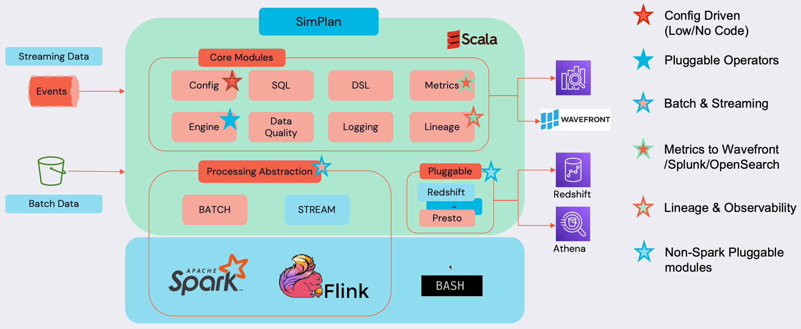

# SimPlan for Apache Spark

For generating customer value from data, Data workers need to process large volumes of batch and streaming data. Separate codebase are maintained for Batch and Streaming modes which leads to siloed implementations for common data processing patterns. This leads to duplicate efforts from implementation to maintenance, hampering productivity.

Users will be able to provide business logic as operators in a config file and the framework will take care of the rest. The framework will take care of the execution of these operators and provide the results to the user. The framework will also provide the lineage of the data and the metrics of the execution.

Simplan Spark is an implementation of Simplan framework which adds SparkApplicationContext to the framework. Refer [Simplan Framework documentation](https://github.intuit.com/pages/Simplan/simplan-framework) to learn more.

## Tech Stack

## Features
- Config Driven (Low/No code)
- Pluggable/Reusable operators for common processing tasks
- Batch and Streaming workloads
- External Integrations : Redshift, Athena, Kafka etc
- Built-In Quality control with circuit breakers.
- Lineage, Observability, and Metrics tracking.
- Integration for Intuit services like IDPS, Config Services, etc
- Improves developer productivity by 10-100 times
- Improves code quality, maintainability and reduces duplication

## Presentations
### Simplan @ [DataAI Summit](https://www.databricks.com/dataaisummit/)
<iframe width="560" height="315" src="https://www.youtube.com/embed/RrOKWN-wHac" title="YouTube video player" frameborder="0" allow="accelerometer; autoplay; clipboard-write; encrypted-media; gyroscope; picture-in-picture" allowfullscreen></iframe>

## Simplan Community
- Join Simplan Slack Channel [#simplan-community](https://intuit-teams.slack.com/archives/C041VUJ278X)
- Ask questions on [StackOverflow](https://stackoverflow.intuit.com/questions/tagged/simplan-spark) using tag `simplan-spark`

## Other Simplan Implementations
- [Simplan Flink](https://github.intuit.com/pages/tabraham1/simplan-flink/)
- [Simplan Presto](https://github.intuit.com/pages/Simplan/simplan-presto/)